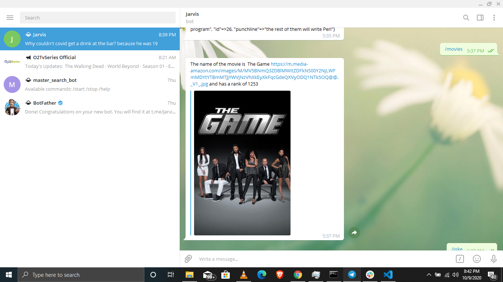

# Telegram-bot

 

> In this project, I built a Telegram Bot that can search the IMDB domains for random movies that will show you a title and the movie ranking on the IMDB page. It also sends you random funny random jokes every time you type in the command /joke. The main goal is to make a massive use of external API`s by putting into practice the main concepts of Object Oriented Programming, classes, modules, objects and accessing their attributes. 
> The project is built using the TDD technique.

## You can see a short demo of the Bot /start command in the screenshot below.

## Video Presentation

Here is the [video explanation](https://www.loom.com/share/4be084d711c04966b9da7eb2969214d7) of this project.###

Live version of the code: [REPL.it](https://repl.it/@rickoburu/Telegram-bot#bin/main.rb)

## Available commands for the Telegram-bot

1. `/start` receive a greetings message
2. `/stop` receive a farewell message.
3. `/joke` receive random joke
4. `/movies` receive random movie with ranking

## Built With

- Ruby
- [Telegram API](https://core.telegram.org/api)
- [IMDB api](https://rapidapi.com/apidojo/api/imdb8)
- RSpec
- Rubocop

## Prerequisities

To get this project up and running locally, you must have ruby installed on your computer.

## Getting Started

**To get this project set up on your local machine, follow these simple steps:**

**Step 1** 
Navigate through the local folder where you want to clone the repository and run 
`git clone https://github.com/RICKCOYL/Telegram-bot.git`.
**Step 2**
Run `cd Telegram-bot` 
**Step 3** 
Run `bundle install` to install the gems from the `Gemfile`. 
**Step 4** 
Download the [Telegram app](https://desktop.telegram.org/), create an account and search for jarvis bot with the username of @Jarvisexcel_bot. 
**Step 5** 
Run `ruby bin/main.rb` to start the bot. 
**Step 6** 
You can use the commands defined in the [Available commands section](#available-commands-for-the-master-search-bot) defined above. 

## Repository Contents

The code for the project is divided into the following directories: **./bin**, **./lib**, and **./spec**.

The **./bin** folder contains the executable **main.rb** file.

The **./lib** folder contains subsidiary files that set up all of the classes and methods used in bin/main.rb

- **jokes.rb**, where the jokes api is.
- **movies.rb**, where the movie class is and imdb api can e found.
- **methods.rb**, the randow method can be found here which is reuable.

The **./spec** folder contains all the relative spec tests

- **jokes_spec.rb**, where the tests for the jokes class are defined.
- **methods_spec.rb**, where the tests for the methods are defined.
- **spec_helper.rb**, initial file generated by the RSpec.

In addition to the above, the repo also contains .rubocop.yml for linting.

## Tests

1. Open Terminal

2. Install RSpec on your system by running:

   `gem install rspec`

3. Run the tests with the command:

   `rspec`

## Authors

👤 **Rick Oburu**

- Github: [https://github.com/RICKCOYL](https://github.com/RICKCOYL)
- Twitter: [https://twitter.com/Rickcoyl](https://twitter.com/Rickcoyl)
- Linkedin: [https://www.linkedin.com/in/rick-oburu-8627591a4/](https://www.linkedin.com/in/rick-oburu-8627591a4/)

## 🤝 Contributing

Feel free to check the [issues page](https://github.com/RICKCOYL/Telegram-bot/issues) to either create an issue or help us out by fixing an existing one.

## Show your support

If you like this project please give it a ⭐️!

## 📝 License

This project is licensed by Microverse and the Odin Project
